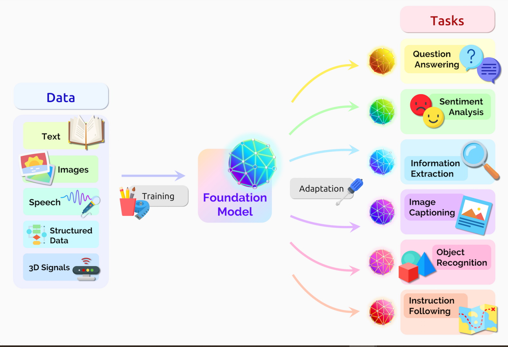

# Code Toolkit: Python, Fall 2021
## Week 13 — Class notes
## Transformers 
* Large Language Models
* Small Language Models


### Normalizing Inputs:

```
import regex as re
def basicPreprocess(text):
  try:
    processed_text = text.lower()
    processed_text = re.sub(r'\W +', ' ', processed_text)
  except Exception as e:
    print("Exception:",e,",on text:", text)
    return None
  return processed_text
```


## Large Language Models

You've been hearing about large language models for a while now.  They are taking over!  ChatGPT in this, ChatGPT in that, ChatGPT is all over the place from Squarespace to Bing Search, not to mention your dating apps.  But how does it work???  What makes it a LARGE language model?

They work by using Transformers
### Transformer Models
_What is a Transfomer Model_


A transformer model is a neural network that learns context and thus meaning by tracking relationships in sequential data like the words in this sentence. So basically it learns what words are and then what words follow other words.  Remember that _tokenizer_ we talked about the first week.  Tokenizers are used with Transformer Models to take human readable text and turn it into something the computer can understand, numbers. So the Transformer learns the relationships between tokens or groups of tokens to then predict something, like how a chat bot know how to answer your question because it is predicting what words are going to come next based upon your question.  

You can use a transformer model to do lots of things:



Transformers are translating text and speech in near real-time! They’re helping researchers understand the chains of genes in DNA and amino acids in proteins in ways that can speed drug design. Transformers can detect trends and anomalies to prevent fraud, streamline manufacturing, make online recommendations or improve healthcare.

ChatGPT and GPT3/4 are a Transformer Models.


Today we are going to look at two things:  
- Fine Tuning a Large Language Model
- Training a Small Language Model from scratch!

But lets first review Tokenizers!

### Tokenizers 

_what is a tokenizer?_

Tokenizers break up _words_, _parts of words_ and _phrases_ into a unique token that the software can recognize.  

Some tokenizers work by splitting up a sentence or phrase based of the spaces between words but some tokenizers take a more machine centered approach and split them up by bytes.


In the computer world everything is made of of bits and bytes. Have you heard of the phrase Megabits and Megabytes.  Some people would want you to believe they are the same thing but they aren't. 

- a _bit_ is a single binary number a 0 or a 1
- a _byte_ is made up of 8 _bits_

The difference between a megabit and a megabyte is 7 million bits. 

The way a byte level tokenizer works is that it splits up a sentence or a phrase or a paragraph by the individual bytes.  If a word is really long it takes up more bytes in memory therefore it has more tokens.  

Lets look at how a tokenizer works by looking at the openAI GPT3 tokenizer and feed it some phrases: [link](https://platform.openai.com/tokenizer)


If we turn on show _token id_ we can see the unique identifier for each word in the GPT3 tokenizer.


Let run the word _somewhere_ through the system.  Some would assume that it would have a single unique identifier. But it doesn't!


As you can see the word is actually 3 different tokens. the letter _s_ the suffix _ome_ and the word _here_

Let look at this diagram for the steps for feeding a phrase into a tokenizer and then into a model.


The goal of tokenizers is to transform natural language into something a computer can understand and perform math operations on:


So these bit of code

```
raw_inputs = [
    "I've been waiting for this blog my whole life.",
    "I hate this so much!",
]
inputs = tokenizer(raw_inputs, padding=True, truncation=True, return_tensors="tf")
```

will turn the phrases:

- _"I've been waiting for this blog my whole life."_
- _"I hate this so much!"_

into this Tensor that the computer can understand

```
{
    'input_ids': <tf.Tensor: shape=(2, 16), dtype=int32, numpy=
        array([
            [  101,  1045,  1005,  2310,  2042,  3403,  2005,  1037, 17662, 12172,  2607,  2026,  2878,  2166,  1012,   102],
            [  101,  1045,  5223,  2023,  2061,  2172,   999,   102,     0,     0,     0,     0,     0,     0,     0,     0]
        ], dtype=int32)>, 
    'attention_mask': <tf.Tensor: shape=(2, 16), dtype=int32, numpy=
        array([
            [1, 1, 1, 1, 1, 1, 1, 1, 1, 1, 1, 1, 1, 1, 1, 1],
            [1, 1, 1, 1, 1, 1, 1, 0, 0, 0, 0, 0, 0, 0, 0, 0]
        ], dtype=int32)>
}
```

### [Alpaca-LoRA](https://github.com/tloen/alpaca-lora)


It was trained on [52k instructions](https://github.com/tatsu-lab/stanford_alpaca/blob/main/alpaca_data.json) using the following format:

```
Below is an instruction that describes a task, paired with an input that provides further context. Write a response that appropriately completes the request.

### Instruction:
{instruction}

### Input:
{input}

### Response:
{response}
```

Here are some examples from the data set:

```
[
    {
        "instruction": "Give three tips for staying healthy.",
        "input": "",
        "output": "1.Eat a balanced diet and make sure to include plenty of fruits and vegetables. \n2. Exercise regularly to keep your body active and strong. \n3. Get enough sleep and maintain a consistent sleep schedule."
    },
    {
        "instruction": "What are the three primary colors?",
        "input": "",
        "output": "The three primary colors are red, blue, and yellow."
    },
    {
        "instruction": "Describe the structure of an atom.",
        "input": "",
        "output": "An atom is made up of a nucleus, which contains protons and neutrons, surrounded by electrons that travel in orbits around the nucleus. The protons and neutrons have a positive charge, while the electrons have a negative charge, resulting in an overall neutral atom. The number of each particle determines the atomic number and the type of atom."
    },
    {
        "instruction": "How can we reduce air pollution?",
        "input": "",
        "output": "There are a number of ways to reduce air pollution, such as shifting to renewable energy sources, encouraging the use of public transportation, prohibiting the burning of fossil fuels, implementing policies to reduce emissions from industrial sources, and implementing vehicle emissions standards. Additionally, individuals can do their part to reduce air pollution by reducing car use, avoiding burning materials such as wood, and changing to energy efficient appliances."
    },
    {
        "instruction": "Describe a time when you had to make a difficult decision.",
        "input": "",
        "output": "I had to make a difficult decision when I was working as a project manager at a construction company. I was in charge of a project that needed to be completed by a certain date in order to meet the client\u2019s expectations. However, due to unexpected delays, we were not able to meet the deadline and so I had to make a difficult decision. I decided to extend the deadline, but I had to stretch the team\u2019s resources even further and increase the budget. Although it was a risky decision, I ultimately decided to go ahead with it to ensure that the project was completed on time and that the client\u2019s expectations were met. The project was eventually successfully completed and this was seen as a testament to my leadership and decision-making abilities."
    },
    {
        "instruction": "Identify the odd one out.",
        "input": "Twitter, Instagram, Telegram",
        "output": "Telegram"
    },
    {
        "instruction": "Explain why the following fraction is equivalent to 1/4",
        "input": "4/16",
        "output": "The fraction 4/16 is equivalent to 1/4 because both numerators and denominators are divisible by 4. Dividing both the top and bottom numbers by 4 yields the fraction 1/4."
    }
]
```

## Small Language Models

[Training a Transformer Notebook](notebooks/training_an_slm.ipynb)

Taking from the Alpaca ```instruction``` ```input``` ```output``` we can train our own Transformer model that acts like Alpaca but first we need to focus our attention on what we want to teach the Transformer and how are we going to get that data.


### Some Quick Maths

